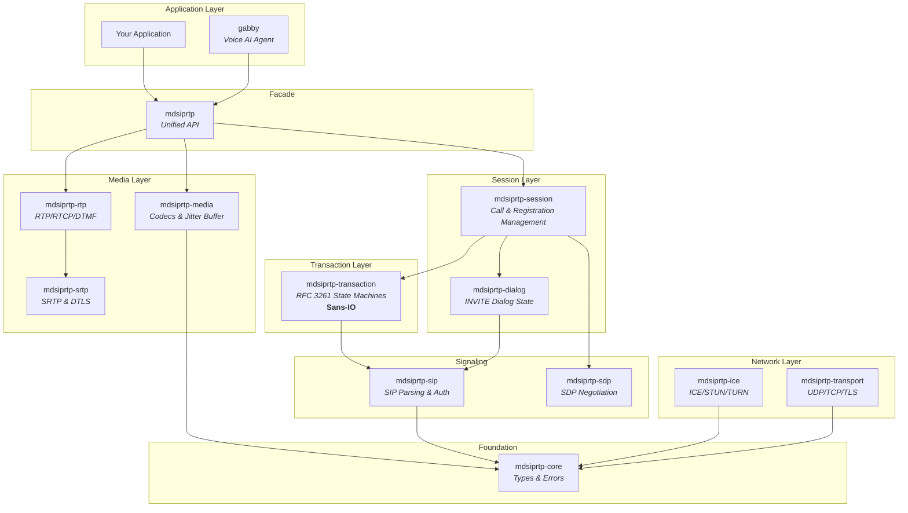
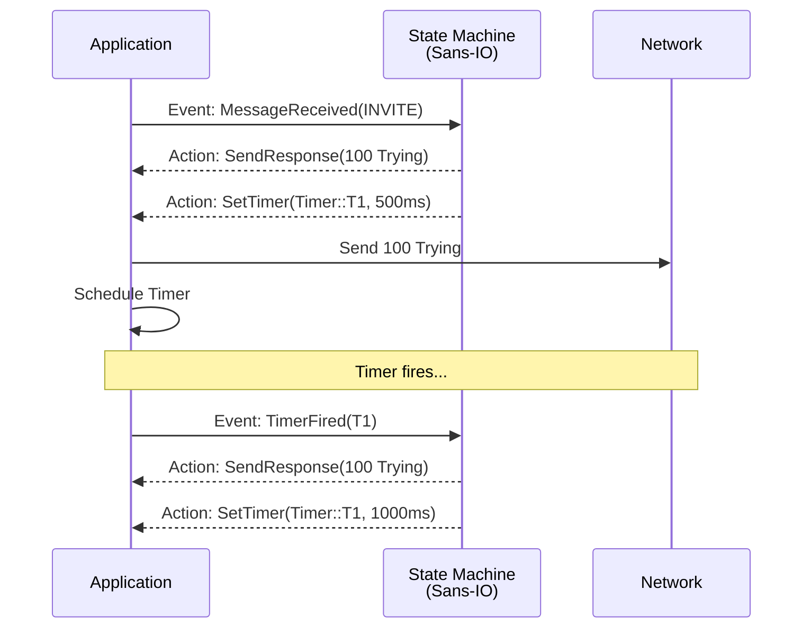
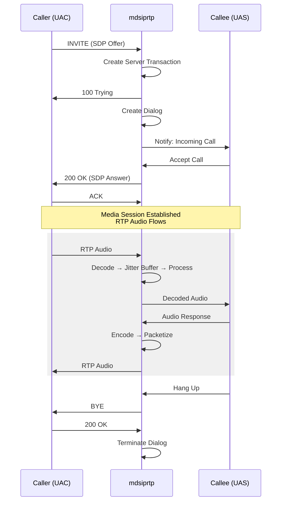
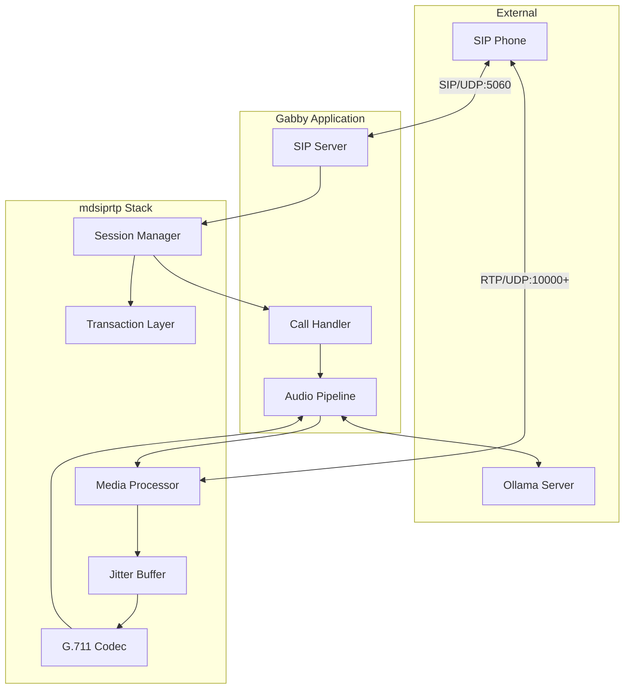

# mdsiprtp & Gabby

**A modular, production-ready SIP/RTP stack for Rust, featuring a Voice AI agent.**


## Project Overview

This repository hosts a comprehensive SIP/RTP communications stack written in Rust, along with a reference implementation of a Voice AI agent.

### Key Components

1.  **mdsiprtp**: The core library. A layered, modular stack designed for building high-performance VoIP applications like voicemail systems, call bridges, and AI assistants. It features a **Sans-IO** architecture for core state machines, making it deterministic and easy to test.
2.  **Gabby** (`crates/gabby`): A standalone Voice AI agent application. It accepts SIP calls and engages in natural conversation using offline Speech-to-Text (Vosk), local LLM inference (Ollama), and Neural Text-to-Speech (Piper).

## Features

*   **SIP/RTP Stack (`mdsiprtp`)**:
    *   **Modular Design**: Split into crates for SIP parsing, transactions, dialogs, SDP, RTP, and media handling.
    *   **Sans-IO Architecture**: Core logic is decoupled from network I/O, allowing for flexible integration with any async runtime (Tokio used by default).
    *   **RFC Compliance**: Implements RFC 3261 (SIP), RFC 3550 (RTP), RFC 4566 (SDP), and related standards.
    *   **Media Processing**: G.711/G.722 codec support, adaptive jitter buffer, and audio mixing.
    *   **Transport**: UDP, TCP, and TLS support.
    *   **Security**: SRTP encryption, DTLS key exchange, ICE/STUN/TURN for NAT traversal.

*   **Voice AI Agent (`Gabby`)**:
    *   **Offline First**: Runs entirely locally (except for optional external LLM APIs if configured).
    *   **Real-time Interaction**: Low-latency pipeline for STT -> LLM -> TTS.
    *   **Voice Activity Detection (VAD)**: Smart interruption and silence detection.

## Architecture

### Crate Structure

The `mdsiprtp` stack is organized into layered crates with clear responsibilities:



### Sans-IO Pattern

The transaction and dialog layers use the **Sans-IO** pattern. State machines receive events and return actions without performing I/O directly. This makes them deterministic, easily testable, and runtime-agnostic.



### SIP Call Flow

A typical SIP INVITE call establishment:



### Gabby Voice Pipeline

Gabby processes audio through a real-time pipeline:

```mermaid
flowchart LR
    subgraph Input["Incoming Audio"]
        SIP_IN[SIP/RTP]
        DECODE[G.711 Decode]
        RESAMPLE_UP[8kHz → 16kHz]
    end

    subgraph Processing["AI Processing"]
        VAD[Voice Activity<br/>Detection]
        STT[Vosk STT]
        LLM[Ollama LLM]
        TTS[Piper TTS]
    end

    subgraph Output["Outgoing Audio"]
        RESAMPLE_DOWN[22kHz → 8kHz]
        ENCODE[G.711 Encode]
        SIP_OUT[SIP/RTP]
    end

    SIP_IN --> DECODE --> RESAMPLE_UP --> VAD
    VAD --> STT
    STT -->|transcript| LLM
    LLM -->|response| TTS
    TTS --> RESAMPLE_DOWN --> ENCODE --> SIP_OUT

    style VAD fill:#f9f,stroke:#333
    style STT fill:#bbf,stroke:#333
    style LLM fill:#bfb,stroke:#333
    style TTS fill:#fbb,stroke:#333
```



### Component Interactions

How the major components interact during a call:



## Getting Started

### Prerequisites

*   **Rust**: Version 1.70 or later.
*   **Docker**: Required for running integration tests (Asterisk container).
*   **Gabby Requirements**: Linux (x86_64/aarch64) is recommended for `libvosk` compatibility. 4GB+ RAM for local LLM inference.

### Building the Project

```bash
cargo build --workspace
```

On Windows, you can either build the library without `gabby`, or install the Vosk Windows binaries and set `VOSK_LIB_DIR` to build `gabby` (see `crates/gabby/README.md`):

```bash
cargo build -p mdsiprtp
# or: cargo build --workspace --exclude gabby

# With Vosk installed on Windows:
# cargo build -p gabby
```

### Running Gabby (Voice AI Agent)

1.  **Install Dependencies**:
    Gabby requires model files for speech recognition and synthesis. Use the provided setup script:
    ```bash
    cd crates/gabby
    ./scripts/setup.sh
    ```

2.  **Start Ollama**:
    Gabby uses Ollama for the LLM backend. Start it in a separate terminal:
    ```bash
    ollama serve
    # Ensure the default model is available
    ollama pull llama3.2:3b
    ```

3.  **Run the Agent**:
    ```bash
    cargo run --release -p gabby
    ```
    Gabby will listen on `0.0.0.0:5060` (SIP) and `10000-20000` (RTP). You can call it using a softphone (e.g., Linphone) at `sip:gabby@<your-ip>:5060`.

### Integration Testing

The project includes an integration test suite that runs against a real Asterisk server.

```bash
# 1. Start the Asterisk infrastructure
docker compose -f docker/docker-compose.yml up -d

# 2. Run integration tests
cargo test --test integration_*
```

## Network Ports

| Port | Protocol | Purpose |
|------|----------|---------|
| 5060 | UDP/TCP | SIP signaling |
| 10000-20000 | UDP | RTP media streams |

## Contributing

1.  **Tests**: Please ensure all tests pass before submitting changes.
    *   Unit tests: `cargo test`
    *   Linting: `cargo clippy`
    *   Formatting: `cargo fmt`
2.  **Coverage**: We aim for high test coverage.

## License

This project is licensed under the MIT License.
